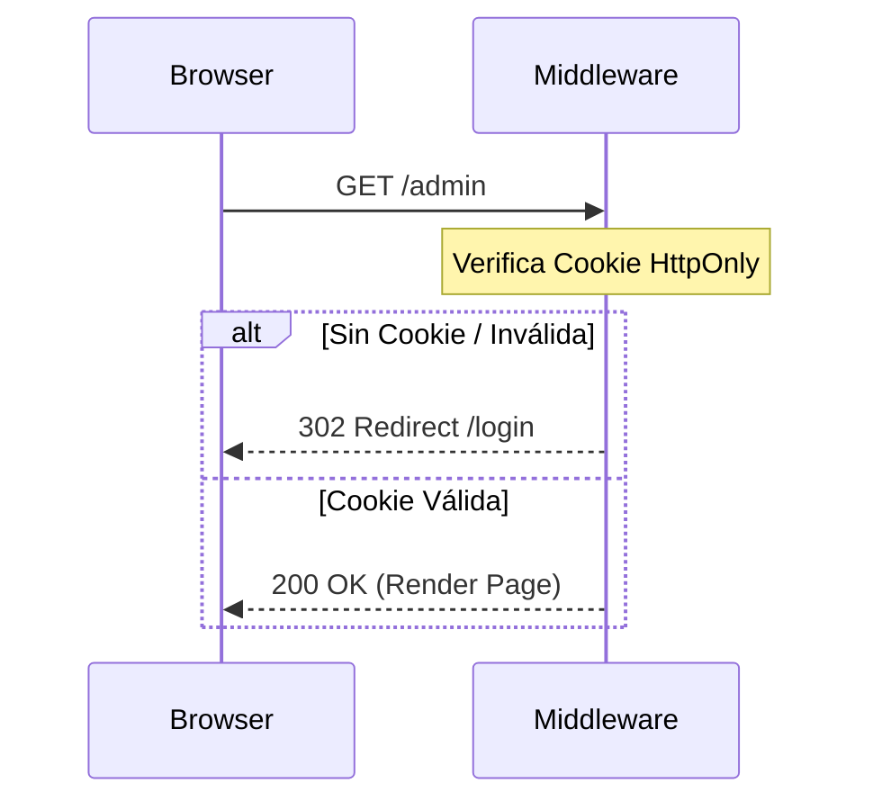

# ADR 0001: Migración de Autenticación a Cookies HttpOnly y Middleware

**Estado:** Aceptado  
**Fecha:** 2026-03-09  
**Implementado:** 2026-03-12  
**Relacionado con:** #89, #67

## Contexto
Actualmente, la aplicación almacena tokens y IDs de sesión en el `localStorage` del navegador. El acceso a las rutas protegidas se valida mediante "guards" en el lado del cliente (React hooks) y validaciones manuales en cada endpoint de la API.

## Problema
1. **Seguridad (XSS):** `localStorage` es accesible mediante JavaScript, lo que expone la sesión a robos mediante ataques de Cross-Site Scripting.
2. **Flicker de UI:** Al validar el acceso en el cliente, existe un breve momento en que el contenido protegido es visible antes de que el script redirija al login.
3. **Invisibilidad para el Servidor:** El servidor no puede "ver" el `localStorage` durante la petición inicial, impidiendo el uso efectivo de un `proxy.ts` de Next.js para protección de rutas.

## Decisión
Migrar el esquema de autenticación a **Cookies HttpOnly** y centralizar la protección de rutas en un **Middleware**.

### Detalles Técnicos:
- **Cookies:** Emitir cookies con los flags `HttpOnly`, `Secure` (solo HTTPS) y `SameSite=Lax`. Implementado en `src/lib/auth/cookie.ts`.
- **Middleware:** Implementar `src/proxy.ts` para interceptar peticiones a `/admin/*`, `/grader/*` y `/register/*`. Usa `jose` para verificar el JWT en Edge Runtime.
- **Logic:** El middleware valida la presencia y validez de la cookie antes de entregar la página al navegador. Los guards cliente (`requireAdmin`, `requireGrader`) fueron eliminados.

## Consecuencias
- **Positivas:** 
    - Eliminación del "flicker" de carga en rutas protegidas.
    - Seguridad robusta contra XSS para la sesión.
    - Código más limpio al remover guards manuales en cada página.
- **Negativas:** 
    - Necesidad de gestionar protecciones contra CSRF.
    - Mayor complejidad en el entorno de desarrollo local (manejo de dominios y puertos).

---
## Diagrama de Flujo (Conceptual)

