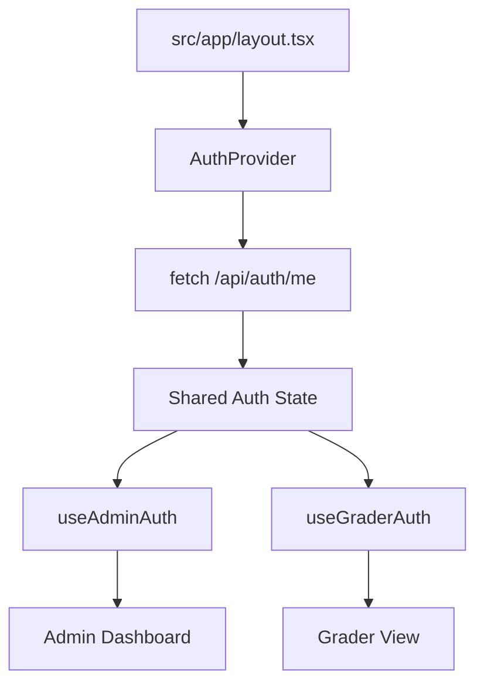

# ADR 0010: Implementación de AuthProvider Centralizado para Estado de Sesión

**Estado:** Propuesto  
**Fecha:** 2026-03-22  
**Implementado:** Pendiente  
**Relacionado con:** [REQ] Centralización de Autenticación mediante AuthContext Provider

## Contexto
La aplicación utiliza múltiples hooks de autenticación (`useAdminAuth`, `useGraderAuth`, `useSuperAdminAuth`) para validar el acceso y obtener los datos del usuario actual (ID, Correo, Rol, AssessmentId). Estos hooks se utilizan en layouts, barras de navegación y páginas protegidas simultáneamente.

## Problema
1. **Llamadas Redundantes:** Cada instancia de un hook de auth dispara su propio `fetch("/api/auth/me")`. En páginas complejas, esto resulta en 4 o más peticiones idénticas al mismo tiempo.
2. **Inconsistencia de Estado:** Diferentes partes de la UI pueden estar en estados de "cargando" distintos, provocando parpadeos (flickering) o inconsistencias visuales.
3. **Carga innecesaria en la API:** El endpoint de sesión es consultado excesivamente, lo que aumenta la latencia percibida y el consumo de recursos (base de datos, CPU).
4. **StrictMode de React:** En desarrollo, el doble montaje de componentes duplica estas llamadas ya redundantes.

## Decisión
Implementar un **`AuthContext`** y un **`AuthProvider`** centralizado en la raíz de la aplicación para gestionar la autenticación como un estado global único.

### Detalles Técnicos:
- **`AuthContext`**: Almacenará `user` (datos decodificados), `isAuthenticated`, `role` y `isLoading`.
- **`AuthProvider`**: Componente de cliente que envolverá a toda la aplicación en `src/app/layout.tsx`. Realizará una **única** petición a `/api/auth/me` al montarse.
- **Refactorización de Hooks**: Los hooks existentes pasarán a ser simples consumidores del `AuthContext` (usando `useContext`), eliminando sus propios efectos de fetch.
- **Sincronización de Logout**: La función `logout` actualizará el estado global del contexto inmediatamente para que toda la UI reaccione al unísono.

## Consecuencias
- **Positivas:** 
    - Reducción drástica del tráfico de red (una sola llamada de auth por carga de página).
    - Estado de sesión coherente en toda la aplicación.
    - Eliminación de condiciones de carrera entre hooks.
    - Código más limpio y centralizado.
- **Negativas:** 
    - Añade una pequeña capa de abstracción (Context API).
    - Requiere que el layout sea un Client Component o que el Provider se maneje cuidadosamente para no romper el SSR de Next.js.

---
## Diagrama (Conceptual)

