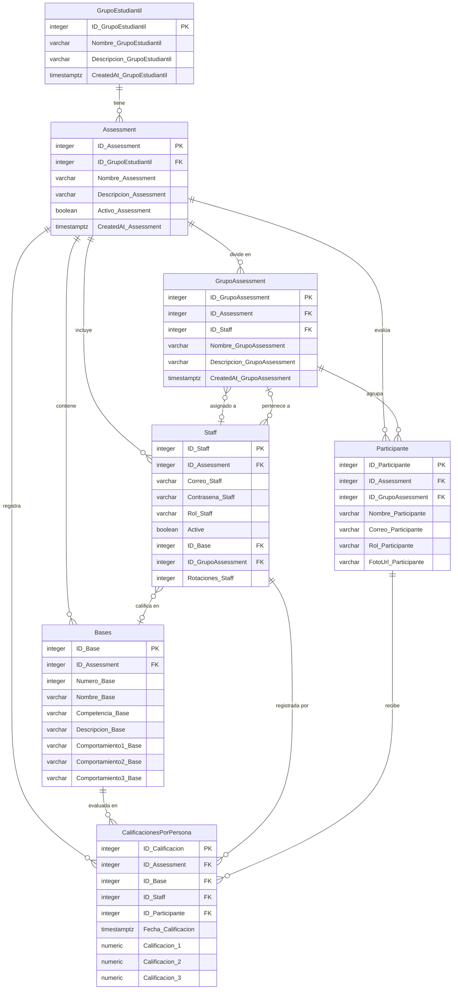

# Entity-Relationship Diagram

This document contains an ER diagram of the database schema, reflecting the **live Supabase state** as verified by the introspection script (`scripts/introspect-schema.ts`).

> Last verified: 2026-03-11 via introspection script against live DB.

## Diagram

## Tables Summary

| Table | Rows (live) | Description |
|-------|-------------|-------------|
| `GrupoEstudiantil` | 1 | Grupo de estudiantes raíz (e.g. Ingeniería de Sistemas) |
| `Assessment` | 3 | Evento de evaluación ligado a un GrupoEstudiantil |
| `GrupoAssessment` | 5 | Subgrupos dentro de un Assessment; tiene un calificador asignado (`ID_Staff`) |
| `Bases` | 6 | Criterios de evaluación por competencia, únicos por Assessment |
| `Staff` | 11 | Calificadores y administradores; puede tener Base y Grupo asignados |
| `Participante` | 29 | Estudiantes a evaluar; pueden tener un grupo asignado |
| `CalificacionesPorPersona` | 17 | Calificaciones (1–5) por comportamiento, sin duplicados por (assessment, base, staff, participante) |

## Key Constraints

- `Bases.Numero_Base` is unique per `Assessment` (`UQ_Bases_Numero_PorAssessment`).
- All FK in `CalificacionesPorPersona` are **composite**, enforcing that Base, Staff, and Participante all belong to the same Assessment.
- `Staff.ID_Base` and `Staff.ID_GrupoAssessment` are nullable (assigned after creation).
- `GrupoAssessment.ID_Staff` is nullable (a group may have no calificador yet).

## Schema Mismatch History

| Date | Table | Change |
|------|-------|--------|
| 2026-03-11 | `GrupoAssessment` | Added `ID_Staff` (nullable FK → Staff) — discovered via introspection, was missing from `schema.sql` |
